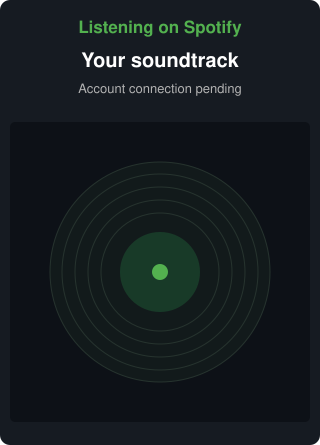

<!-- Generated from profile.config.json with npm run readme. -->

<h1 align="center">Hi there, I&apos;m Kang&#8209;min Kim 👋</h1>

<picture>
  <source media="(prefers-color-scheme: dark)" srcset="https://readme-typing-svg.herokuapp.com/?font=Fira+Code&amp;size=20&amp;duration=3000&amp;pause=1500&amp;color=70A5FD&amp;center=true&amp;vCenter=true&amp;width=420&amp;height=42&amp;lines=Building+useful+things.%3BWeb%2C+mobile%2C+and+AI.%3BLearning+by+shipping.">
  <source media="(prefers-color-scheme: light)" srcset="https://readme-typing-svg.herokuapp.com/?font=Fira+Code&amp;size=20&amp;duration=3000&amp;pause=1500&amp;color=0969DA&amp;center=true&amp;vCenter=true&amp;width=420&amp;height=42&amp;lines=Building+useful+things.%3BWeb%2C+mobile%2C+and+AI.%3BLearning+by+shipping.">
  
</picture>

  
  

  
  

A developer in Seoul who likes solving everyday problems. 
I build web, mobile, and AI tools, and learn by shipping.

## 🛠️ Skills

<strong>Languages</strong>

  
  
  
  

<strong>Web &amp; Mobile</strong>

  
  
  
  
  
  
  

<strong>Backend, Data &amp; AI</strong>

  
  
  
  
  
  

<strong>Cloud &amp; Observability</strong>

  
  
  
  

<strong>Testing &amp; Tooling</strong>

  
  
  
  
  

<strong>AI Tools</strong>

  
  

<em>Powered by curiosity, Claude, and Codex.</em>

---

  <a href="https://github.com/rkdals0203#contributions">
<picture>
  <source media="(prefers-color-scheme: dark)" srcset="https://raw.githubusercontent.com/rkdals0203/rkdals0203/output/activity-dark.svg">
  <source media="(prefers-color-scheme: light)" srcset="https://raw.githubusercontent.com/rkdals0203/rkdals0203/output/activity-light.svg">
  
</picture>
  </a>
  &nbsp;&nbsp;
  

<a href="https://open.spotify.com">Listen on Spotify ↗</a>

<picture>
  <source media="(prefers-color-scheme: dark)" srcset="https://raw.githubusercontent.com/rkdals0203/rkdals0203/output/snake-dark.svg">
  <source media="(prefers-color-scheme: light)" srcset="https://raw.githubusercontent.com/rkdals0203/rkdals0203/output/snake-light.svg">
  
</picture>

